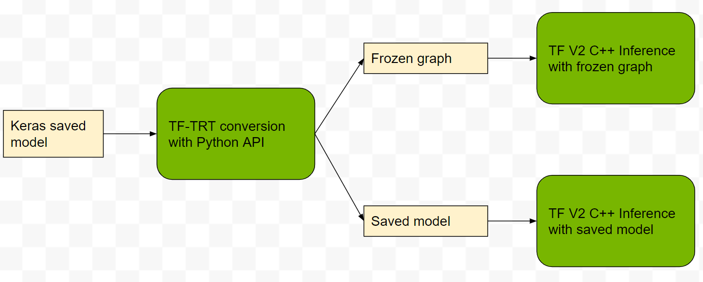

<!-- #region -->

# TF-TRT C++ Image Recognition Demo

This example shows how you can load a native TF Keras ResNet-50 model, convert it to a TF-TRT optimized model (via the TF-TRT Python API), save the model as either a frozen graph or a saved model, and then finally load and serve the model with the TF C++ API. The process can be demonstrated with the below workflow diagram:

This example is built based upon the original Google's TensorFlow C++ image classification [example](https://github.com/tensorflow/tensorflow/tree/master/tensorflow/examples/label_image), on top of which we added the TF-TRT conversion part and adapted the C++ code for loading and inferencing with the TF-TRT model.

See the respective sub-folder for details on either approach.