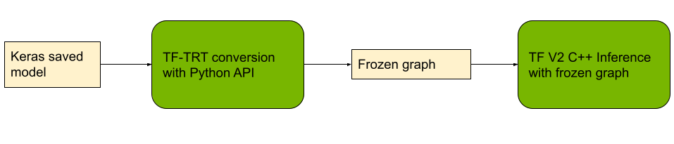

<!-- #region -->


# TF-TRT C++ Image Recognition Demo

This example shows how you can load a native TF Keras ResNet-50 model, convert it to a TF-TRT optimized model (via the TF-TRT Python API), save the model as a frozen graph, and then finally load and serve the model with the TF C++ API. The process can be demonstrated with the below workflow diagram:




This example is built based upon the original Google's TensorFlow C++ image classification [example](https://github.com/tensorflow/tensorflow/tree/master/tensorflow/examples/label_image), on top of which we added the TF-TRT conversion part and adapted the C++ code for loading and inferencing with the TF-TRT model.

## Docker environment
Docker images provide a convinient and repeatable environment for experimentation. This workflow was tested in the NVIDIA NGC TensorFlow 22.01 docker container that comes with a TensorFlow 2.x build. Tools required for building this example, such as Bazel, NVIDIA CUDA, CUDNN, NCCL libraries are all readily setup.

To replecate the below steps, start by pulling the NGC TF container:

```
docker pull nvcr.io/nvidia/tensorflow:22.01-tf2-py3
```
Then start the container with nvidia-docker:

```
nvidia-docker run --rm -it -p 8888:8888 --name TFTRT_CPP nvcr.io/nvidia/tensorflow:22.01-tf2-py3
```

You will land at `/workspace` within the docker container. Clone the TF-TRT example repository with:

```
git clone https://github.com/tensorflow/tensorrt
cd tensorrt 
```

Then copy the content of this C++ example directory to the TensorFlow example source directory:

```
cp -r ./tftrt/examples-cpp/image_classification/ /opt/tensorflow/tensorflow-source/tensorflow/examples/
cd /opt/tensorflow/tensorflow-source/tensorflow/examples/image_classification
```

<!-- #region -->
## Convert to TF-TRT Model

Start Jupyter lab with:

```
jupyter lab -ip 0.0.0.0
```

A Jupyter notebook for downloading the Keras ResNet-50 model and TF-TRT conversion is provided in `tf-trt-conversion.ipynb` for your  experimentation. By default, this notebook will produce a TF-TRT FP32 model at `/opt/tensorflow/tensorflow-source/tensorflow/examples/image-classification/frozen_models_trt_fp32/frozen_models_trt_fp32.pb`.

As part of the conversion, the notebook will also carry out benchmarking and print out the throughput statistics. 


<!-- #endregion -->

## Build the C++ example
The NVIDIA NGC container should have everything you need to run this example installed already.

To build it, first, you need to copy the build scripts `tftrt_build.sh` to `/opt/tensorflow`:

```
cp tftrt-build.sh /opt/tensorflow
```

Then from `/opt/tensorflow`, run the build command:

```bash
cd /opt/tensorflow 
bash ./tftrt-build.sh
```

That should build a binary executable `tftrt_label_image` that you can then run like this:

```bash
tensorflow-source/bazel-bin/tensorflow/examples/image_classification/tftrt_label_image \
--graph=/opt/tensorflow/tensorflow-source/tensorflow/examples/image_classification/frozen_models_trt_fp32/frozen_models_trt_fp32.pb \
--image=/opt/tensorflow/tensorflow-source/tensorflow/examples/image_classification/data/img0.JPG
```

This uses the default image `img0.JPG` which was download as part of the conversion notebook, and should
output something similar to this:

```
2022-02-23 13:53:56.076348: I tensorflow/examples/image-classification/main.cc:276] malamute (250): 0.575496
2022-02-23 13:53:56.076384: I tensorflow/examples/image-classification/main.cc:276] Saint Bernard (248): 0.399285
2022-02-23 13:53:56.076412: I tensorflow/examples/image-classification/main.cc:276] Eskimo dog (249): 0.0228338
2022-02-23 13:53:56.076423: I tensorflow/examples/image-classification/main.cc:276] Ibizan hound (174): 0.00127912
2022-02-23 13:53:56.076449: I tensorflow/examples/image-classification/main.cc:276] Mexican hairless (269): 0.000520922
```

The program will also benchmark and output the throughput. Observe the improved throughput offered by moving from Python to C++ serving.

Next, try it out on your own images by supplying the --image= argument, e.g.

```bash
tensorflow-source/bazel-bin/tensorflow/examples/label_image/tftrt_label_image --image=my_image.png
```

## What's next

Try to build TF-TRT FP16 and INT8 models and test on your own data, and serve them with C++.

```bash

```
